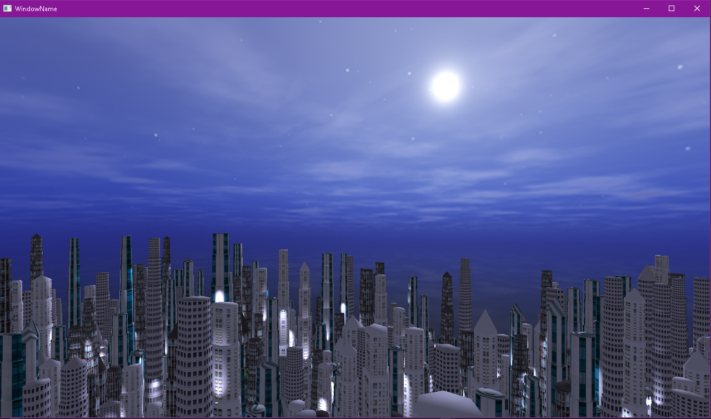

### Description: ###
#### Buildings: ####
The buildings are stacked prisms and some have a pyramid on top. The base of each prism is a polygon with up to 16 edges. To create the base polygon, a random number of points are generated on a circle, randomly translated and rotated. The vertices, edges and triangles of the final mesh are procedurally generated in world space.

#### City: ####
The city is a 30 x 35 grid of buildings, decorations and roads. A road will take an entire row or column of the matrix, the rest of the space in the gridd will be take by buildings and status. The roads are also populated by vehicles.

#### Illumination: ####
All buildings and status are illuminated by dynamic spotlights. Each one of those have at least two spotlights illuminating their facade.

### Screenshots: ###

### Reference: ###
#### 3D Models: ####
http://www.cadnav.com/3d-models/model-39109.html
http://www.cadnav.com/3d-models/model-39046.html
https://free3d.com/3d-model/cartoon-low-poly-city-cars-pack-32084.html
https://www.turbosquid.com/FullPreview/Index.cfm/ID/613771
https://www.turbosquid.com/FullPreview/Index.cfm/ID/1333537

#### Textures: ####
https://images.freecreatives.com/wp-content/uploads/2015/05/158.jpg
http://3.bp.blogspot.com/-0CMx7T-MuwM/UkdqSerH4FI/AAAAAAAAMEw/Ddmj12qBoyM/s1600/Tileable_Hexagonal_Stone_Pavement_Texture_DISP.jpg
https://www.textures.com/download/buildingshighrise0623/104591
https://www.pexels.com/photo/building-pattern-wall-architecture-33317/
https://www.pexels.com/photo/beige-and-blue-tiled-surface-845234/
https://www.pexels.com/photo/concrete-building-1567355/
